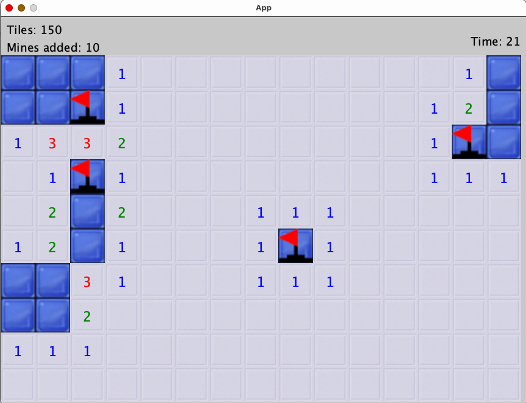
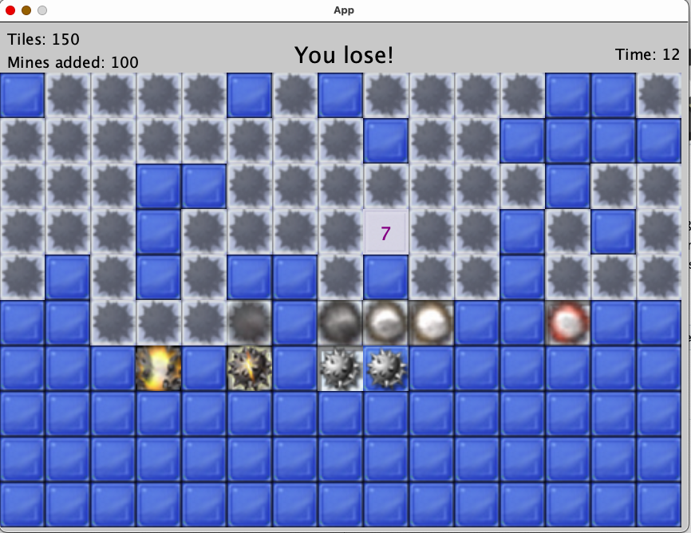
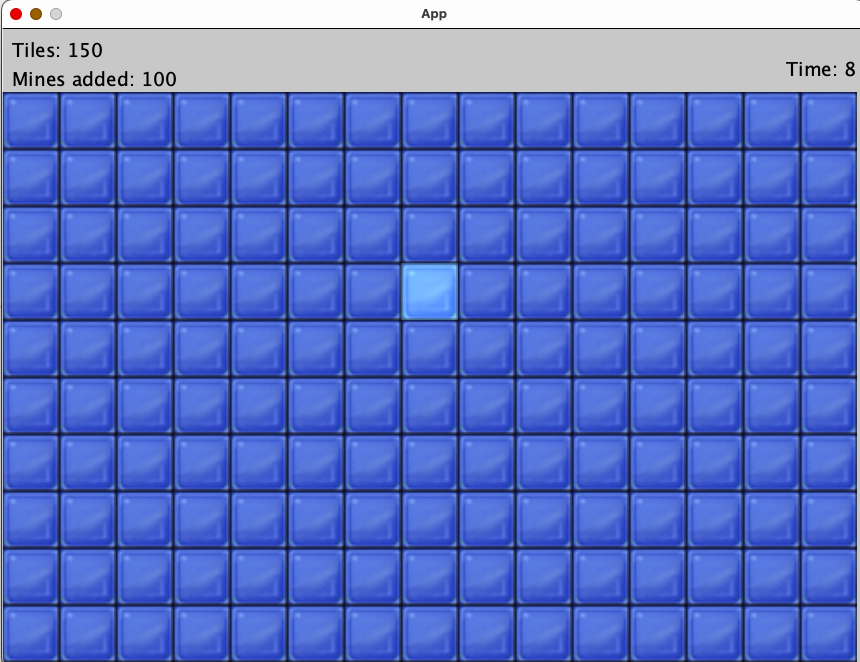

# Minesweeper Game
This is a **Minesweeper game** implemented in Java using the **Processing** library. The game features classic Minesweeper mechanics, including randomly placed mines, tile reveals, flags, a timer, and explosion animations. The player has the option to specify the number of mines desired before generating the board. 

## Features
* **18x27 Grid** – Mines are randomly placed across the grid.  
* **Command-line Arguments** – The first argument sets the number of mines (default: `100`).  
* **Tile Reveal Logic** – Clicking a tile shows the number of adjacent mines (or triggers a chain reveal).  
* **Mine Explosions** – Mines explode progressively, with an animated sequence.  
* **Win/Loss Conditions** – The game ends when all safe tiles are revealed or a mine is clicked.  
* **Flagging System** – Right-clicking places a flag, preventing accidental reveals.  
* **Timer** – Displays elapsed time in the **top-right corner**.  
* **Restart Button** – Press `R` to reset the board and start a new game.  

## How to play: 
1. Reveal all non-mine tiles.
2. Avoid clicking on a mine!
3. Use right-click to flag tiles you suspect contain mines.

<!--  -->

- If you reveal all safe tiles, the message "You Win!" appears. If you click a mine, "You Lost!" appears.
---

## Installation & Running the Game
1. Clone the repo 
2. Build and run the program using Gradle with the command line argument 'args="x"', replacing x wit the desired integer number of mines.
